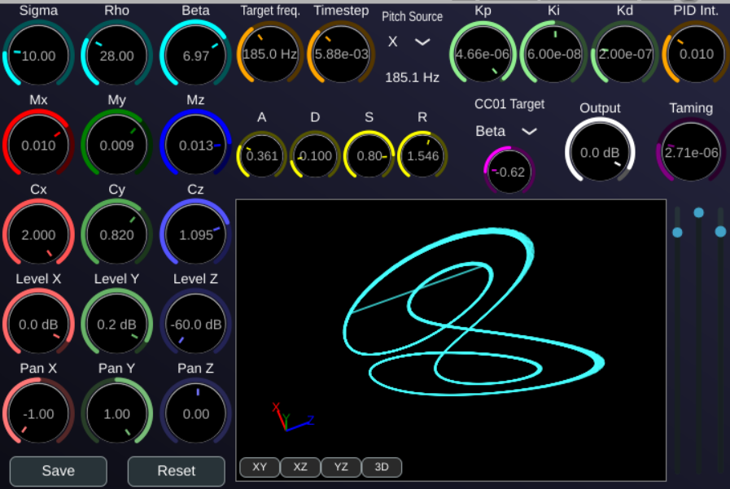

# Lorenz, the the Lorenz ottractor instrument

Lorenz is a unique software synthesizer plugin that generates sound by simulating a modified version of the Lorenz attractor, a classic example of a chaotic system. Instead of using traditional oscillators, it uses the evolving state of the attractor to create complex, ever-changing, and organic sounds.



## The Classic Lorenz Attractor

The original Lorenz system is a set of three coupled first-order ordinary differential equations:

```
dx/dt = σ * (y - x)
dy/dt = x * (ρ - z) - y
dz/dt = x * y - β * z
```

Where:
*   `x`, `y`, and `z` are the state variables of the system.
*   `σ` (sigma), `ρ` (rho), and `β` (beta) are parameters that control the behavior of the system.

For certain parameter values (e.g., σ=10, ρ=28, β=8/3), the system exhibits chaotic behavior. This means its evolution is highly sensitive to initial conditions, and while it follows deterministic rules, its long-term behavior is unpredictable. The path it traces in 3D space forms the famous "butterfly" shape.

## Modifications for Sound Synthesis

To create a more versatile and controllable musical instrument, this plugin uses a significantly modified version of the Lorenz equations.

### Second-Order System

The system has been extended to a **second-order system**, similar to a mass-spring-damper model. We now have velocity (`vx`, `vy`, `vz`) and acceleration (`dvx/dt`, `dvy/dt`, `dvz/dt`). This introduces inertia and damping into the system, allowing for a wider range of sonic textures, in particular more parameters regions where the system has periodic oscillations.

The full system of equations simulated in the plugin is:

```
MX * d²x/dt² = σ * (y - x) - CX * dx/dt - Taming * (dx/dt)³
MY * d²y/dt² = x * (ρ - z) - y - CY * dy/dt - Taming * (dy/dt)³
MZ * d²z/dt² = x * y - β * z - CZ * dz/dt - Taming * (dz/dt)³
```

This adds new parameters:
*   **Mass (`MX`, `MY`, `MZ`):** Controls the inertia of each component. Higher mass values will make the system react more slowly to changes.
*   **Damping (`CX`, `CY`, `CZ`):** Acts as a linear "brake" on the system's velocity, controlling the decay of oscillations.
 
### Taming Parameter

Chaotic systems can sometimes become unstable and "blow up," with their state variables shooting towards infinity, which would result in silence or extreme digital noise. The **Taming** parameter introduces a non-linear damping force that gets stronger as the system's velocity increases. This helps to keep the attractor within a stable, bounded region, making it more musically reliable without sacrificing its chaotic nature.

## How It Works

### Sound Generation

The three state variables of the simulation—`x`, `y`, and `z`—are used directly as three separate audio sources. You can think of them as three chaotic oscillators.

*   **Mixer:** The `LEVEL` and `PAN` controls for X, Y, and Z allow you to mix these three sources together to create a final stereo sound.
*   **ADSR Envelope:** When you press a MIDI note, a standard ADSR (Attack, Decay, Sustain, Release) envelope is triggered, shaping the volume of the sound over time.

### Pitch Control

Controlling the pitch of a chaotic system is not straightforward. This plugin uses an innovative feedback mechanism to "steer" the attractor's frequency towards a musical note.

1.  **Target Frequency:** When you play a note on your MIDI keyboard, it sets a target frequency.
2.  **Pitch Detection:** The plugin continuously analyzes the output signal (you can choose between X, Y, or Z as the source) to measure its fundamental frequency.
3.  **PID Controller:** A PID (Proportional-Integral-Derivative) controller compares the measured frequency to the target frequency.
4.  **Timestep Adjustment:** Based on the error between the target and measured frequencies, the PID controller adjusts the simulation's **Timestep**.
    *   A smaller timestep slows down the simulation, producing lower frequencies.
    *   A larger timestep speeds it up, producing higher frequencies.

This creates a dynamic feedback loop where the plugin is constantly trying to guide its chaotic output to match the note you are playing. The character of the sound and the "looseness" of the pitch tracking can be fine-tuned using the PID gain parameters (`KP`, `KI`, `KD`).

## How to Use It

1.  **Play a note:** Use your MIDI keyboard to play notes. The plugin is monophonic with legato, so overlapping notes will glide in pitch.
2.  **Sculpt the Attractor:**
    *   Start with the classic `Sigma`, `Rho`, and `Beta` parameters to change the fundamental shape and behavior of the attractor.
    *   Use the `Mass` (`MX, MY, MZ`) and `Damping` (`CX, CY, CZ`) knobs to alter the physical properties of the sound.
3.  **Mix the Sound:**
    *   Use the `LEVEL` knobs for X, Y, and Z to blend the three chaotic sources. They sound very different!
    *   Use the `PAN` knobs to create a wide stereo image.
4.  **Control the Pitch:**
    *   Use the `Pitch Source` selector to choose which signal (X, Y, or Z) the pitch tracker listens to.
    *   Adjust the PID gains (`KP`, `KI`, `KD`) to change how tightly the sound locks onto a pitch. Low values will result in a "drunken" pitch that wanders around the note. High values will make it lock on more tightly, but can sometimes introduce its own fluttery artifacts.
5.  **Shape the Dynamics:** Use the `ATTACK`, `DECAY`, `SUSTAIN`, and `RELEASE` knobs to shape the sound's volume envelope.
6.  **Modulate:** Use the `Mod Target` and `Mod Amount` controls to assign MIDI CC01 (Mod Wheel) to modulate one of the core attractor parameters for expressive, real-time control.
7.  **Reset:** If the sound becomes silent or stuck (which can happen with chaotic systems!), press the **Reset Oscillator** button to restart the simulation from its initial state.

## Contact

olivier.doare@ensta.fr
